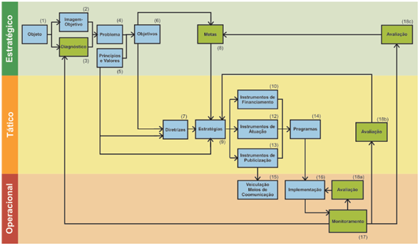
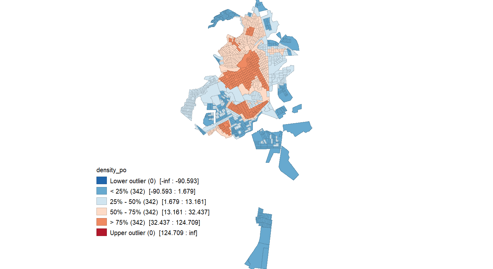
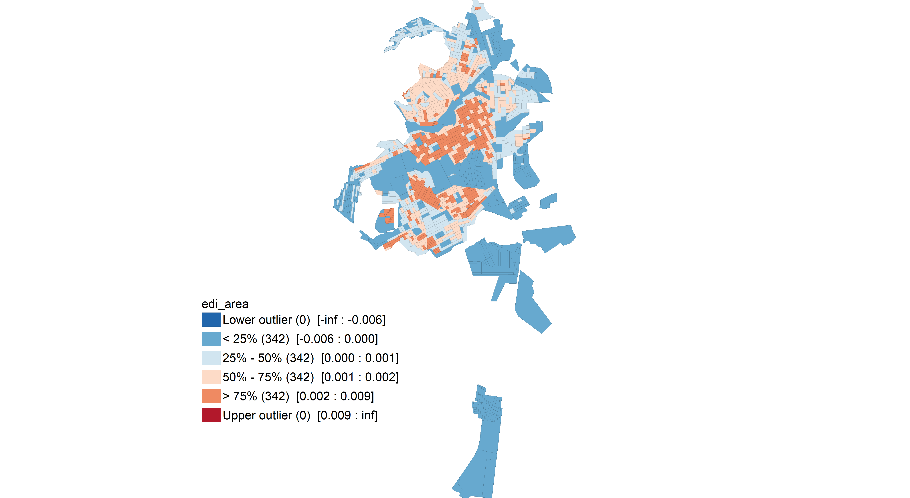
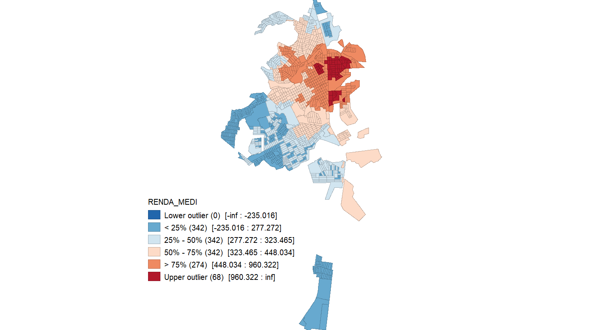
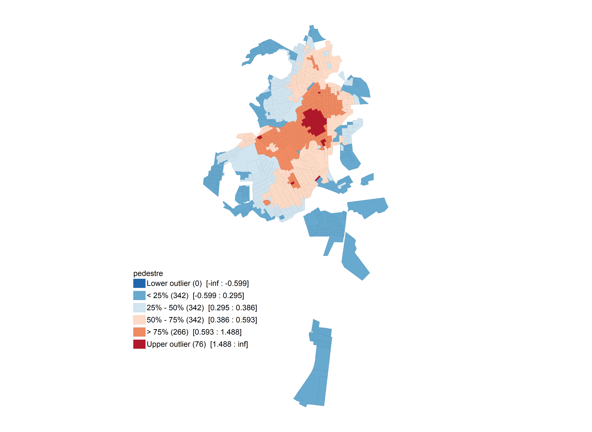
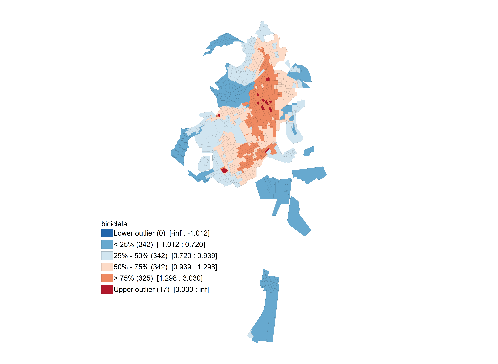
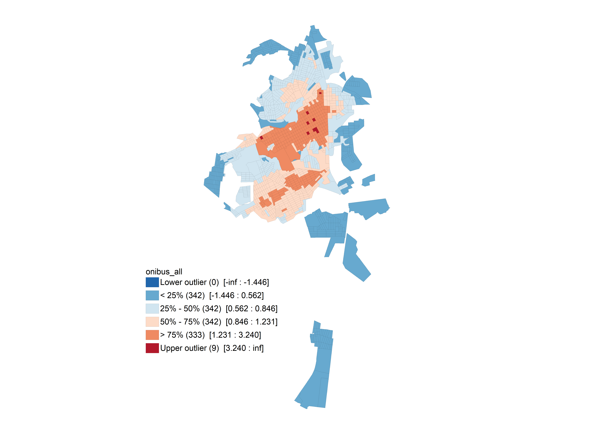
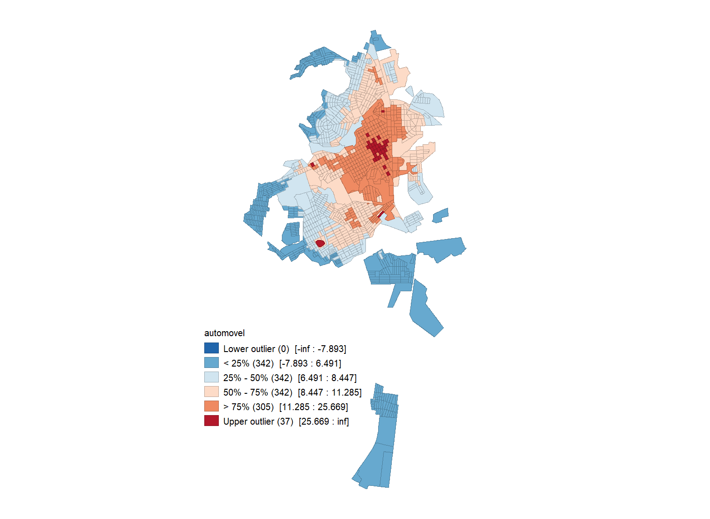

```{r setup, include=FALSE}
options(htmltools.dir.version = FALSE)
```

# PlanMob

### Paradigma de planejamento

```{r echo=FALSE, message=FALSE, warning=FALSE, out.width="80%", fig.align = 'center'}

```

---
# PlanMob

#### PRINCÍPIOS

I.	reconhecimento do espaço público como bem comum, titularizado pelo município;   
II.	equidade no uso do espaço público de circulação e sistema de transporte público;   
III.	acessibilidade universal e universalidade do direito de se deslocar e de usufruir a cidade;     
IV.	desenvolvimento sustentável da cidade, nas dimensões socioeconômica e ambiental;    
V.	justa distribuição dos benefícios e ônus decorrentes do uso dos diferentes modos de transporte e serviços    
VI.	gestão democrática e controle social de seu planejamento e avaliação;    
VII.	segurança nos deslocamentos para promoção da saúde e garantia da vida;   
VIII.	eficiência, eficácia e efetividade na circulação urbana e na prestação do serviço de transporte urbano.   

---

# PlanMob

#### DIRETRIZES

I.	integração com a política municipal de desenvolvimento urbano e respectivas políticas setoriais de habitação, saneamento básico, planejamento e gestão do uso do solo no âmbito do Município;   
II.	incentivo ao transporte ativo e priorização dos transportes não motorizados sobre os motorizados para alocação de recursos;   
III.	criação de medidas de desestímulo à utilização do transporte individual motorizado;   
IV.	acesso ao sistema de transporte público para todos os habitantes;    
V.	integração dos diversos meios de transporte;   
VI.	mitigação dos custos ambientais, sociais e econômicos dos deslocamentos de pessoas e cargas no Município;   
VII.	consolidação da rede viária estrutural;   
VIII.	busca por alternativas de financiamento para as ações necessárias à implementação do PlanMob;   
IX.	promoção de ações educativas capazes de sensibilizar e conscientizar a população sobre a importância de se atender aos princípios do PlanMob.   

---

# PlanMob

#### Objetivo Geral

"promover a universalização do acesso à cidade, a melhoria da qualidade ambiental e o controle dos impactos gerados pelo sistema de mobilidade na cidade, proporcionando condições seguras de circulação de pessoas atendendo aos princípios de acessibilidade e mobilidade universal."

---

# PlanMob

#### Estrutura de discussão dos objetivos específicos

COMPONENTE >> DIMENSÃO >> OBJETIVO

##### Componentes
- Transporte a pé   
- Transporte cicloviário   
- Transporte público coletivo   
- Transporte individual privado  
- Sistema viário   
- Transporte de cargas   
- Integração modal   
- Pólos geradores de cargas  
- Estrutura institucional   

---
# PlanMob

### Método para priorização de áreas e avaliação das intervenções

1. Determinação das áreas prioritárias em alinhamento com as **componentes** e **dimensões**. Assim, as áreas prioritárias podem ser diferentes para cada conjunto de objetivos e diferentes critérios podem ser considerados ou desconsiderados. Para cada componente, serão identificados os critérios de criticidade da demanda, combinados espacialmente. Essa classificação da **criticidade da demanda** será sobreposta com a **criticidade da oferta** para identificação das **áreas prioritárias**.  

2. Após determinar as áreas prióritárias, são necessárias etapas para: 
- listar intervenções
- verificar seu impacto nos níveis de acessibilidade considerando os critérios utilizados na priorização das áreas e considerar a população impactada pelas ações.
- classificar os investimentos (alto, médio e baixo, por exemplo) em relação ao aporte financeiro
- realizar uma análise impacto x investimento para priorição e escalonamento temporal das intervenções. 

---

# PlanMob

### Critérios gerais para priorização de áreas<sup>1</sup>

- população impactada
- vulnerabilidade econômica
- concentração de atividades econômicas
- acessibilidade potencial pelos diferentes modos
- condição da infraestrutura

.footnote[
[1] Para modos ativos, a declividade será considerada como um fator de restrição à implementação de intervenções, mas não como critério de priorização de onde intervir.
]
---
# PlanMob

#### Critérios gerais para priorização de áreas

```{r echo=FALSE, message=FALSE, warning=FALSE, out.width="100%", fig.align = 'center', fig.cap="Densidade Populacional"}

```

---

# PlanMob

#### Critérios gerais para priorização de áreas

```{r echo=FALSE, message=FALSE, warning=FALSE, out.width="100%", fig.align = 'center', fig.cap="Número de edificações comerciais"}

```
---

# PlanMob

#### Critérios gerais para priorização de áreas

```{r echo=FALSE, message=FALSE, warning=FALSE, out.width="100%", fig.align = 'center', fig.cap="Renda média domiciliar"}

```
---

# PlanMob

#### Critérios gerais para priorização de áreas<sup>*</sup>

```{r echo=FALSE, message=FALSE, warning=FALSE, out.width="73%", fig.align = 'center', fig.cap="Acessibilidade potencial a pé"}

```
.footnote[
* Não foram padronizadas as classes para comparação. (Dúvida!)
]
---
# PlanMob

#### Critérios gerais para priorização de áreas

```{r echo=FALSE, message=FALSE, warning=FALSE, out.width="73%", fig.align = 'center', fig.cap="Acessibilidade potencial por bicicleta"}

```

---
# PlanMob

#### Critérios gerais para priorização de áreas

```{r echo=FALSE, message=FALSE, warning=FALSE, out.width="73%", fig.align = 'center', fig.cap="Acessibilidade potencial por ônibus"}

```

---
# PlanMob

#### Critérios gerais para priorização de áreas

```{r echo=FALSE, message=FALSE, warning=FALSE, out.width="73%", fig.align = 'center', fig.cap="Acessibilidade potencial por automóvel"}

```

---
# PlanMob

### Transporte a pé

#### Objetivos 

- Qualificar calçadas acessíveis em toda a extensão viária.   
- Promover a mobilidade ativa.   
- Qualificar percursos acessíveis em toda a extensão viária.  

**Criticidade da demanda**
- áreas com baixa acessibilidade a pé (valores abaixo da mediana)
- áreas com menor proporção (primeiro quartil - 25% mais vulneráveis) de renda e concentração populacional.
- áreas com elevada concentração de atividade comercial (maiores densidades - 25%)

**Criticidade da oferta**
- áreas com menor oferta infraestrutura de circulação de pedestres (valores abaixo da mediana). Como atributos para fomento dos deslocamentos a pé, têm-se: (i) calçada; (ii) iluminação; (iii) meio fio; e (iv) calçada especial.

---

# PlanMob

### Transporte cicloviário

#### Objetivos

- Fomentar a atratividade do modo cicloviário.   
- Aumentar o uso da bicicleta para transporte na cidade.

**Criticidade da demanda**
- áreas com baixa acessibilidade por bicicleta (valores abaixo da mediana)
- áreas com menor proporção (primeiro quartil - 25% mais vulneráveis) de renda e concentração populacional.
- áreas com elevada concentração de atividade comercial (maiores densidades - 25%) - pensar na infraestrutura - paraciclos.

**Criticidade da oferta**
- toda a cidade com exceção de áreas com declividade viária acima de 6%.
- áreas com menor oferta infraestrutura de circulação de bicicletas (valores abaixo da mediana). O único atributo que temos é a iluminação.


---

# PlanMob
### Transporte público coletivo
#### Objetivos

- Qualificar pontos de embarque e desembarque em toda a cidade.   
- Universalizar acesso ao sistema de transporte coletivo.   
- Aumentar o uso do sistema de transporte público coletivo na cidade.   
- Alcançar acessibilidade universal no sistema de transporte coletivo.   

**Criticidade da demanda**
- áreas com menor proporção (valores abaixo da mediana) de renda e concentração populacional.
- áreas com elevada concentração de atividade comercial (maiores densidades - 25%) - destinos dos itinerários

**Criticidade da oferta**
- áreas não atendidas a uma distância de acesso ao sistema mínima de 500 metros (**Dúvida**)

---

# PlanMob

### Transporte individual

#### Objetivos
 
- Equilibrar a oferta de estacionamentos com o uso do sistema viário por todos os sistemas de transportes.   
- Reduzir o uso de automóvel e motocicleta em deslocamentos urbanos.   

**Criticidade da demanda**
- áreas com elevada concentração de atividade comercial (maiores densidades - 25%) - estacionamentos.  


**Criticidade da oferta**
- áreas com ocorrência de vias não pavimentadas. 

---

# PlanMob

### Sistema viário

#### Objetivos
 
- Estruturar rede viária adequada e distribuída de forma equilibrada entre os diferentes modos de transporte.   
- Propiciar ambientes agradáveis para circulação e permanência de pessoas.   
- Fornecer trajetos seguros para todos os usuários dos sistemas de mobilidade.   
- Reduzir acidentes de trânsito.   

Os critérios de criticidade foram contemplados na discussão de cada modo. 

---

# PlanMob

### Transporte de cargas

#### Objetivos
 
- Reduzir impactos da circulação de veículos de carga na cidade e das operações de carga e descarga.
- Definir localização e procedimento operacional de utilização de de vagas de carga e descarga

**Criticidade da demanda**
- áreas com elevada concentração de atividade comercial (valores maiores que a mediana) - estacionamentos.  

**Criticidade da oferta**
- Todaa cidade, uma vez que não há delimitação de vagas de carga e descarga. 

---

# PlanMob

### Integração modal

#### Objetivos
 
- Promover a integração modal nos sistemas de transporte da cidade.


---

# PlanMob

### Polos geradores de carga

#### Objetivos
 
- Integrar medidas mitigadoras aos objetivos de mobilidade urbana.


---

# PlanMob

### Estrutura institucional

#### Objetivos
 
- Alcançar capacidade plena de planejamento, monitoramento e avaliação de ações coordenadas relacionadas à mobilidade urbana.   
- Alcançar capacidade plena de fiscalização do trânsito e transporte.   
- Alcançar capacidade plena de promover educação de trânsito em diversos níveis na cidade.  


